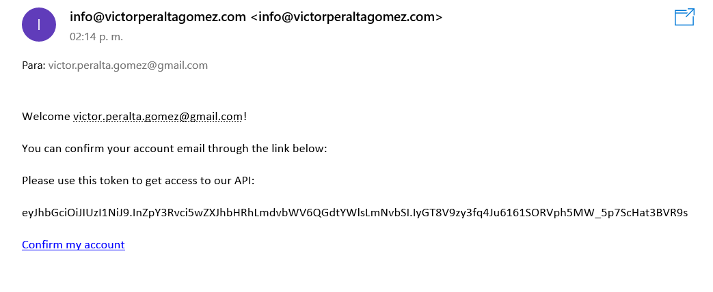
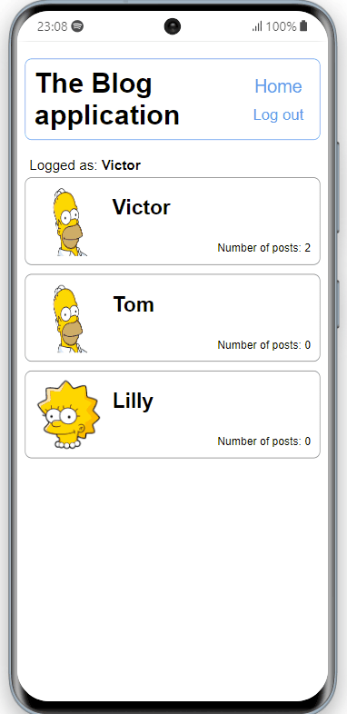

# Blog app

A blog app built using Ruby on Rails that allows you to make posts about anything you want.

You can also use the application API to query about posts of an individual author, check the post's comments, and even make a new one.

You need to register with your email and password. After completion, you will receive an email asking you to confirm your account. In that email, you will also receive your API token to use the API.

# API

To use the API make sure to have your token.

## Endpoints
- POST `https://safe-brook-54426.herokuapp.com/users/{author_id}/show`  
Retreives a list of posts for the specified author. The body of the request must be of type json and contain the API token

- POST `https://safe-brook-54426.herokuapp.com/posts/{post_id}/comments`  
Retrieves a list of posts for the specified author. The body of the request must be of type json and contain the API token and the comment (text) to be added

More to be added!!  
You can review the documentation by visiting:  
[Api documentation](https://safe-brook-54426.herokuapp.com/api-docs/index.html)

## Built With

- Ruby
- Rails

## Prerequisites  
- PostgreSql   
- Ruby (2.7 or newer)
- Bundle (2.1.4 or newer)

## Getting Started

To get a local copy follow these simple steps.  

1.- Open the terminal window and clone the repository using this command:  
`git clone git@github.com:VicPeralta/blogapp.git` 

2.- Change the directory to the blogapp directory  
`cd blogapp`  
3.- Install the project's dependencies by running this command:   
`bundle install`  
4.- Change the database configuration file (`database.yml`) to fit your local database's settings   
5.- Start the server using this command:  
`rails s`   
6.- Open the browser at this address:  
`http://127.0.0.1:3000/`   

## Live demo

You can try the functionality of this application by clicking: 
[Demo](https://safe-brook-54426.herokuapp.com/)

## Authors

👤 **Victor Peralta**
- GitHub: [@VicPeralta](https://github.com/VicPeralta)
- Twitter: [@VicPeralta](https://twitter.com/VicPeralta)
- Linkedin: [@VicPeralta](https://www.linkedin.com/in/vicperalta/)

👤 **Behnam Aghaali**

- GitHub: [https://github.com/Behnam1369](https://github.com/Behnam1369)
- LinkedIn: [https://www.linkedin.com/in/behnam-aghaali](https://www.linkedin.com/in/behnam-aghaali)
- Twitter: [https://twitter.com/behnamagh1369](https://twitter.com/behnamagh1369)

## 🤝 Contributing

Contributions, issues, and feature requests are welcome!

Feel free to check the [issues page](../../issues/).

## Show your support

Give a ⭐️ if you like this project!
The gem is available as open source under the terms of the [MIT License](https://opensource.org/licenses/MIT).
