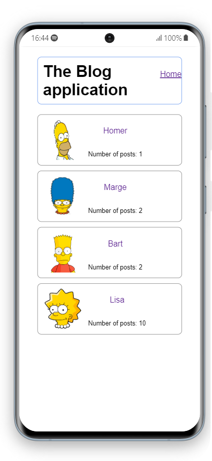

# Blog app

A blog app build using Ruby on Rails

## Built With

- Ruby
- Rails

## Prerequisites  
- PostgreSql   
- Ruby (2.7 or newer)
- Bundle (2.1.4 or newer)

## Getting Started

To get a local copy follow these simple example steps.  

1.- Open the terminal window and clone the repository using this command:  
`git clone git@github.com:VicPeralta/blogapp.git` 

2.- Change the directory to the blogapp directory  
`cd blogapp`  
3.- Install the project's dependencies by running this command:   
`bundle install`  
4.- Change the database configuration file (`database.yml`) to fit your local database's settings   
5.- Start the server using this command:  
`rails s`   
6.- Open the browser at this address:  
`http://127.0.0.1:3000/`   

## Live demo
[Demo](https://safe-brook-54426.herokuapp.com/)

## Authors

👤 **Victor Peralta**
- GitHub: [@VicPeralta](https://github.com/VicPeralta)
- Twitter: [@VicPeralta](https://twitter.com/VicPeralta)
- Linkedin: [@VicPeralta](https://www.linkedin.com/in/vicperalta/)

👤 **Behnam Aghaali**

- GitHub: [https://github.com/Behnam1369](https://github.com/Behnam1369)
- LinkedIn: [https://www.linkedin.com/in/behnam-aghaali](https://www.linkedin.com/in/behnam-aghaali)
- Twitter: [https://twitter.com/behnamagh1369](https://twitter.com/behnamagh1369)

## 🤝 Contributing

Contributions, issues, and feature requests are welcome!

Feel free to check the [issues page](../../issues/).

## Show your support

Give a ⭐️ if you like this project!
The gem is available as open source under the terms of the [MIT License](https://opensource.org/licenses/MIT).
